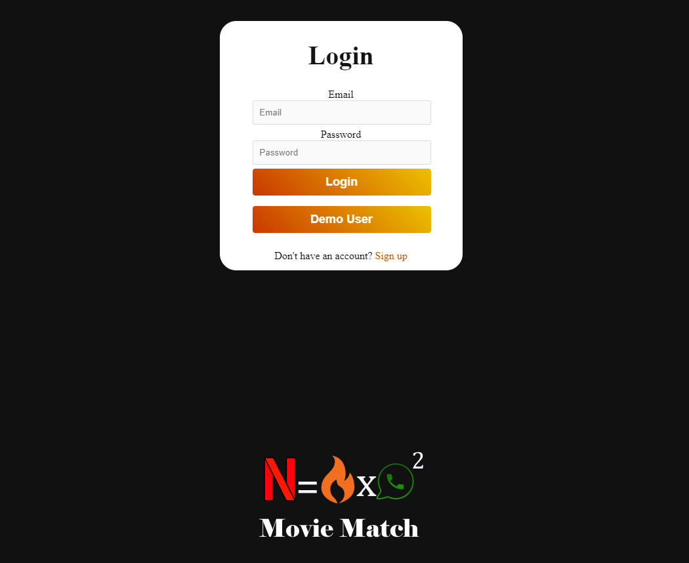
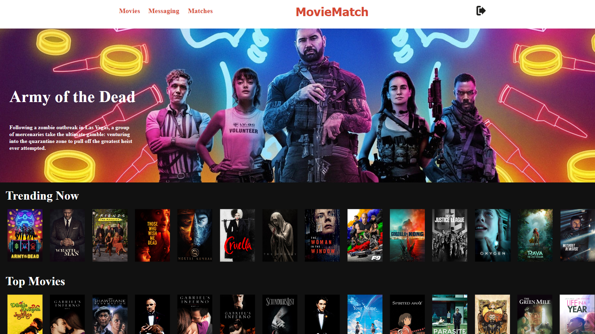
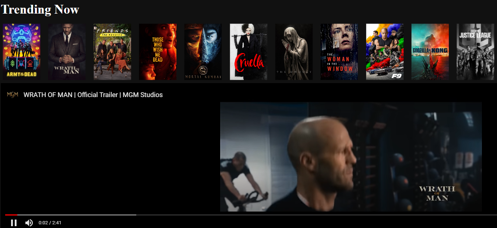
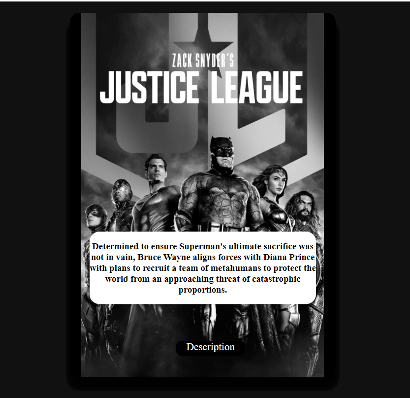
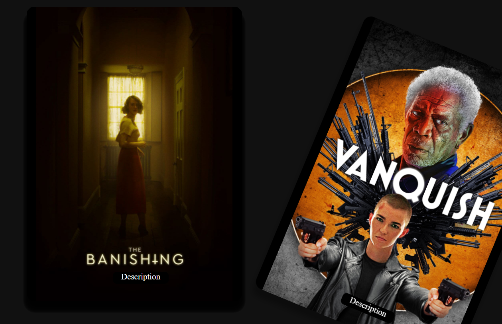
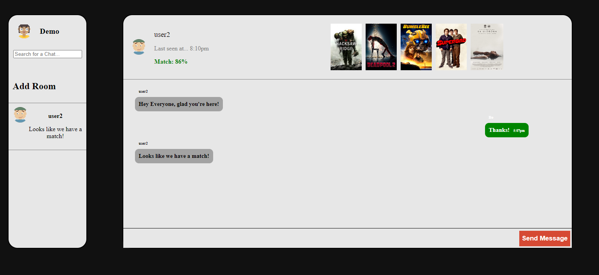

# MovieMatch

MovieMatch is a fusion between Netflix, Tinder, and Whatapp. When you are in the mood to watch a movie with a friend or group. Instead of endlessly browsing, match a movie and skip the headache. The platform has a "discover movie page" this is the Netflix portion. Each movie is clickable to display the movie's trailer. Each user has a personal "list" of movie they want to watch by swiping movie cards. This really gives the Tinder feel. All the platform has to do is match arrays between users to find which movies "match." If you aren't with your friends, you can use the optional messaging feature to talk real time with your friends.

Netflix Portion - Live & Working

Tinder Portion - Fully Swipable with auto refresh of new cards, List creation in Progress

WhatApp Portion - Platform Stable, Rooms not pairing with users, Messaging currently not sending

# Features
## 1. Login Page with preconfigured Demo user Login and Easy Sign Up Link

  

## 2. Netflix Inspired Discover Page

  

## 3. Clickable Movies for Instant Trailers (click movie again to end & hide display)

  

## 4. Tinder Inspired Cards to swipe movies you like and dislike

  

## 5. Tinder-like animation effects on swipe

  

## 6. Whatsapp Inspired Messaging using SocketIO-flask

  

# Obstacles

Trying to implement socket channels for users instead of servers.

Taking API data and transferring it into usable arrays for users that do not dissapear on site refresh.

# Conclusion

Overall, I am content with how the project turned out in a just a few weeks. There is definitely a learning curve when using websockets and I am happy to be able to keep working on it. My favorite feature is the swipable cards. I ran into so many issues with the cards not rendering properly, and having a clean finished product is very satisfying. I enjoyed working with React/Redux and my skills are defeinitely improving. 

